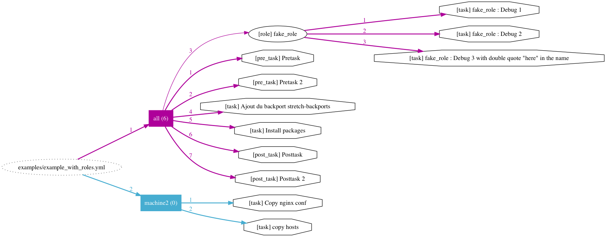

# Ansible Playbook Grapher

[](https://badge.fury.io/py/ansible-playbook-grapher)

[ansible-playbook-grapher](https://github.com/haidaraM/ansible-playbook-grapher) is a command line tool to create a graph representing your Ansible playbook tasks and roles. The aim of
this project is to quickly have an overview of your playbook.

Inspired by [Ansible Inventory Grapher](https://github.com/willthames/ansible-inventory-grapher).

## Pérequis
 * **Ansible** >= 2.4: The script has not been tested yet with an earlier version of Ansible. 
 ```
 $ sudo pip3 install 'ansible>=2.4'
 ```
 * **graphviz**: The tool used to generate the graph in SVG. 
 ```
 $ sudo apt-get install graphviz
 ```
 
## Installation
```
$ sudo pip3 install ansible-playbook-grapher
```

## Usage

```
$ ansible-playbook-grapher examples/playbook.yml
```


```
$ ansible-playbook-grapher --include-role-tasks  examples/example_with_roles.yml
```





Some options are available:

```
$ ansible-playbook-grapher --help
Usage: ansible-playbook-grapher [options] playbook.yml

Make graph from your Playbook.

Options:
  --ask-vault-pass      ask for vault password
  -e EXTRA_VARS, --extra-vars=EXTRA_VARS
                        set additional variables as key=value or YAML/JSON, if
                        filename prepend with @
  -h, --help            show this help message and exit
  --include-role-tasks  Include the tasks of the role in the graph.
  -i INVENTORY, --inventory=INVENTORY
                        specify inventory host path (default=[%s]) or comma
                        separated host list.
  --new-vault-id=NEW_VAULT_ID
                        the new vault identity to use for rekey
  --new-vault-password-file=NEW_VAULT_PASSWORD_FILES
                        new vault password file for rekey
  -o OUTPUT_FILE_NAME, --ouput-file-name=OUTPUT_FILE_NAME
                        Output filename without the '.svg' extension. Default:
                        <playbook>.svg
  -s, --save-dot-file   Save the dot file used to generate the graph.
  --skip-tags=SKIP_TAGS
                        only run plays and tasks whose tags do not match these
                        values
  -t TAGS, --tags=TAGS  only run plays and tasks tagged with these values
  --vault-id=VAULT_IDS  the vault identity to use
  --vault-password-file=VAULT_PASSWORD_FILES
                        vault password file
  -v, --verbose         verbose mode (-vvv for more, -vvvv to enable
                        connection debugging)
  --version             show program's version number and exit

```

## Contribution
Contributions are welcome. Feel free to contribute by creating an issue or submitting a PR :smiley: 

## TODO
 - Graphviz : properly rank the edge of the graph to represent the order of the execution of the tasks and roles
 - Graphviz : find a way to avoid or reduce edges overlapping
 - Ansible: Variables interpolation in node name (when possible)
  